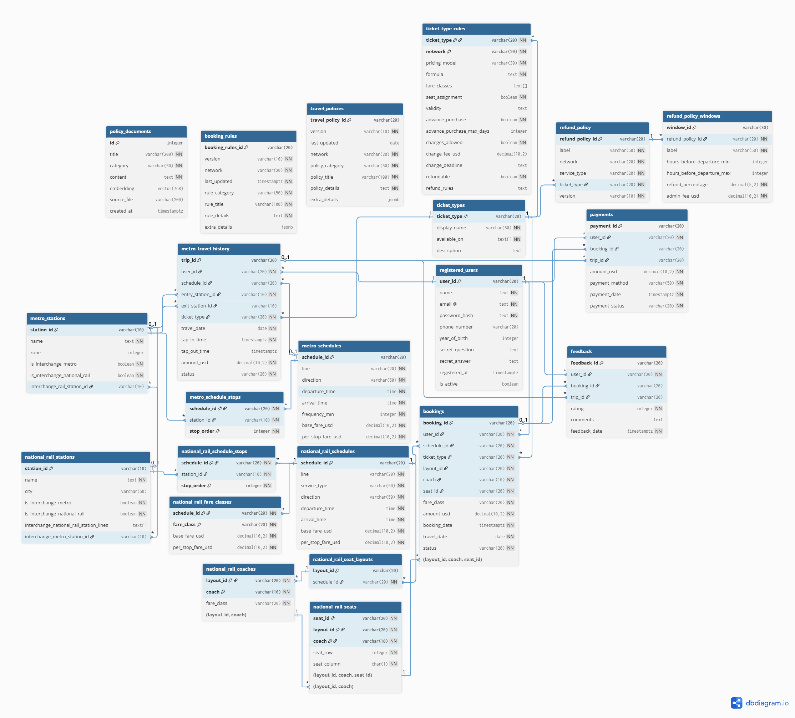

# Team17 Design Document — TransitFlow

## Section 1 — Entity-Relationship Diagram



# Transportation Ticketing System — Database Schema Specification

This document defines the database tables, Primary Keys (PK), Foreign Keys (FK), and business logic relationships across the four core modules of the system.

---

## 1. Core Users & Transactions
This module handles user registration, ticket transactions, payment logs, and post-trip feedback.

###  `registered_users`
* **Key Fields**:
    * `user_id` (PK): Unique identifier for each user.
* **Relationships**: Referenced by multiple tables. A single user can have multiple travel history records (`metro_travel_history`), multiple reservations (`bookings`), multiple payments (`payments`), and multiple feedback entries (`feedback`).

###  `bookings`
* **Key Fields**:
    * `booking_id` (PK): Unique identifier for each booking.
    * `user_id` (FK): Links to `registered_users.user_id` (identifies which user made the booking).
    * `schedule_id` (FK): Links to `national_rail_schedules.schedule_id` (identifies the specific rail schedule).
    * `ticket_type` (FK): Links to `ticket_types.ticket_type` (identifies the ticket category used).
    * `layout_id`, `coach`, `seat_id` (FK): Composite foreign keys linking to the seating system to ensure the reserved seat physically exists on the train.

###  `payments`
* **Key Fields**:
    * `payment_id` (PK): Unique identifier for each payment.
    * `user_id` (FK): Links to `registered_users.user_id`.
    * `booking_id` (FK, Nullable): Links to `bookings.booking_id` (populated if the payment is for a national rail ticket).
    * `trip_id` (FK, Nullable): Links to `metro_travel_history.trip_id` (populated if the payment is for a metro fare deduction).

###  `feedback`
* **Key Fields**:
    * `feedback_id` (PK): Unique identifier for each feedback entry.
    * `user_id` (FK): Links to `registered_users.user_id` (identifies the passenger providing feedback).
    * `booking_id` (FK): Links to `bookings.booking_id` (associates the feedback with a specific booking).

---

## 2. Metro System
Handles urban transit/metro stations, standard schedules, and passenger tap-in/tap-out travel logs.

###  `metro_stations`
* **Key Fields**:
    * `station_id` (PK): Unique identifier for each metro station.
* **Relationships**: Referenced by schedule timetables (`metro_schedule_stops`) and passenger travel logs (`metro_travel_history`).

###  `metro_schedules
* **Key Fields**:
    * `schedule_id` (PK): Unique identifier for each metro schedule.

###  `metro_schedule_stops`
* **Key Fields**:
    * `schedule_id` (PK, FK): Links to `metro_schedules.schedule_id`.
    * `station_id` (PK, FK): Links to `metro_stations.station_id`.

###  `metro_travel_history`
* **Key Fields**:
    * `trip_id` (PK): Unique identifier for each travel record.
    * `user_id` (FK): Links to `registered_users.user_id` (identifies the commuter).
    * `schedule_id` (FK): Links to `metro_schedules.schedule_id` (identifies the train taken).
    * `entry_station_id` (FK): Links to `metro_stations.station_id` (the tap-in station).
    * `exit_station_id` (FK): Links to `metro_stations.station_id` (the tap-out station).

---

## 3. National Rail & Seats
Manages intercity, long-distance rail schedules, coach configurations, and fine-grained seat-level allocation systems.

###  `national_rail_stations`
* **Key Fields**:
    * `station_id` (PK): Unique identifier for each national rail station.

###  `national_rail_schedules`
* **Key Fields**:
    * `schedule_id` (PK): Unique identifier for each national rail schedule.

###  `national_rail_schedule_stops`
* **Key Fields**:
    * `schedule_id` (PK, FK): Links to `national_rail_schedules.schedule_id`.
    * `station_id` (PK, FK): Links to `national_rail_stations.station_id`.

###  `national_rail_coaches` & `national_rail_seat_layouts` & `national_rail_seats`
* **Core Business Logic**: 
    * These tables are interconnected via `layout_id` and `coach` to define which train models contain which coaches, and the exact seat layout (e.g., 1A, 1B) within each coach (`national_rail_seats`).
    * Ultimately, the `seat_id`, `coach`, and `layout_id` fields in the `bookings` table map to this module as FKs, preventing ghost bookings or double-booking errors.

---

## 4. Policies & Rules (Look-up Tables)
This module serves as the administrative backend control panel and strategy engine, primarily used for data validation, compliance check, and dynamic fare calculations.

###  `ticket_types`
* **Key Fields**:
    * `ticket_type` (PK): e.g., `ADULT`, `CONCESSION`, `STUDENT`.
* **Relationships**: Widely referenced as an FK by fare rule matrices (`ticket_type_rules`), cancellation policies (`refund_policy`), and transaction logs.

###  `refund_policy` & `refund_policy_windows`
* **Core Business Logic**: 
    * The primary key for `refund_policy` is `refund_policy_id`.
    * `refund_policy_windows` links back to the parent table via the `refund_policy_id` FK.
    * **One-to-Many Relationship**: This structure implements a tiered fee schedule (e.g., "Cancel X hours before departure to incur a Y% processing fee").

###  Static Controls & Legal Documentation Tables
* `booking_rules`: Governs limits such as maximum tickets per purchase or advance booking windows.
* `travel_policies`: Enforces operational guidelines regarding pets, oversized luggage, etc.
* `policy_documents`: Stores text assets like privacy policies and terms of service for frontend rendering.
* **Core Function**: These tables store system parameters, legal clauses, or algorithmic variables (such as `pricing_model` or `formula`) utilized by the backend API to dynamically compute distance-based or zone-based fares.
---
This document provides a concise breakdown of the **1:1 (One-to-One)**, **1:N (One-to-Many)**, and **M:N (Many-to-Many)** relationships for each table in the schema shown in "Untitled.jpg".

## 1. Core Users & Bookings

### `registered_users`
* **1:N Relationship:** To `bookings`, `metro_travel_history`, `payments`, and `feedback` (A single user can have multiple bookings, transit trips, payment transactions, and feedback records).

### `bookings`
* **1:N Relationship:** To `payments` and `feedback` (A single booking can trigger multiple payment attempts or correspond to multiple feedback responses).
* **M:N Junction:** Acts as the bridge connecting `registered_users` (M) and `national_rail_schedules` (N).

### `payments`
* **1:N "Many" Side:** Belongs to `registered_users` and `bookings`.

### `feedback`
* **1:N "Many" Side:** Belongs to `registered_users`, `bookings`, and `metro_travel_history`.

---

## 2. Tickets & Policies

### `ticket_types`
* **1:N Relationship:** To `bookings`, `metro_travel_history`, and `refund_policy`.

### `ticket_type_rules`
* **1:1 Relationship:** To `ticket_types` (Under a specific transport network, one ticket type maps to exactly one detailed pricing rule).

### `refund_policy`
* **1:N Relationship:** To `refund_policy_windows` (A single refund policy defines multiple refund percentage windows based on time frames).

### `refund_policy_windows`
* **1:N "Many" Side:** Belongs to `refund_policy`.

---

## 3. Metro System

### `metro_travel_history`
* **1:N Relationship:** To `feedback`.

### `metro_stations`
* **1:N Relationship:** To `metro_travel_history` (Acts as the entry station or exit station for multiple trips).
* **M:N Bridge End:** Shares a many-to-many relationship with `metro_schedules`, implemented via `metro_schedule_steps`.

### `metro_schedules`
* **1:N Relationship:** To `metro_travel_history`.
* **M:N Bridge End:** Shares a many-to-many relationship with `metro_stations`, implemented via `metro_schedule_steps`.

### `metro_schedule_steps`
* **M:N Junction Table:** Resolves the many-to-many relationship between `metro_schedules` (M) and `metro_stations` (N).

---

## 4. National Rail System

### `national_rail_stations`
* **M:N Bridge End:** Shares a many-to-many relationship with `national_rail_schedules`, implemented via `national_rail_schedule_stops`.

### `national_rail_schedules`
* **1:1 Relationship:** To `national_rail_seat_layouts` (A specific train schedule is bound to exactly one seat layout configuration).
* **1:N Relationship:** To `bookings` and `national_rail_fare_classes` (A schedule handles multiple bookings and hosts multiple fare pricing classes).
* **M:N Bridge End:** Shares a many-to-many relationship with `national_rail_stations`, implemented via `national_rail_schedule_stops`.

### `national_rail_schedule_stops`
* **M:N Junction Table:** Resolves the many-to-many relationship between `national_rail_schedules` (M) and `national_rail_stations` (N).

### `national_rail_fare_classes`
* **1:N "Many" Side:** Belongs to `national_rail_schedules`.

### `national_rail_seat_layouts`
* **1:1 Relationship:** To `national_rail_schedules`.
* **1:N Relationship:** To `national_rail_coaches` (A single layout comprises multiple coaches).

### `national_rail_coaches`
* **1:N Relationship:** To `national_rail_seats` (A single coach contains multiple specific seats).

### `national_rail_seats`
* **1:N "Many" Side:** Belongs to `national_rail_coaches`.

---
*Note: `travel_policies`, `booking_rules`, and `policy_documents` operate as independent configuration or content tables within this schema and do not have direct hardcoded relationship lines.*

## Section 2 — Normalisation Justification
This section delves into the core database design choices for the TransitFlow system. It covers the rationale behind our Third Normal Form (3NF) relational database schema, the deliberate denormalization trade-offs made to optimize performance in real-world business contexts, and the cryptographic password hashing architecture implemented to safeguard user account data.

---

## 1. Normalisation to 3NF: Design Decisions & Theoretical Implementation

In the TransitFlow system, the scheduling architecture for train trips and their corresponding stops (as seen in `metro_schedules.json` and `national_rail_schedules.json`) represents a textbook application of Third Normal Form (3NF). We explicitly rejected the denormalized approach of storing stop sequences as an array within a single field. Instead, we isolated this data into an independent associative table named `schedule_stops` (the schedule stop junction table).

### Functional Dependency (FD) Analysis
* **1NF (First Normal Form) Compliance:** Let `schedule_id` be the unique identifier for a trip schedule, and `station_id` be the unique identifier for a station. If an array field were used to cram all stops into the primary schedule table, it would introduce non-atomic values, violating 1NF. Breaking them out into distinct rows guarantees that every attribute contains only atomic values.
* **2NF (Second Normal Form) Compliance:** In the `schedule_stops` table, the Composite Primary Key is defined as `(schedule_id, station_id)`. Within this structure, non-key attributes such as `arrival_time` and `stop_order` are **fully functionally dependent** on the entire composite primary key. There are no partial dependencies where an attribute relies on only a subset of the key. Eliminating partial dependencies satisfies 2NF.
* **3NF (Third Normal Form) Compliance:** No transitive dependencies exist among the non-key attributes. For instance, `arrival_time` is determined strictly by the combination of schedule and station; it is not transitively determined through any other non-key fields. Every non-key attribute depends directly on the key—adhering to the classic relational database golden rule: "*Depend on the key, the whole key, and nothing but the key*." This fulfills 3NF.

### Advantages of the Design Decision
This 3NF junction table design effectively eliminates Update Anomalies. For example, if a specific station's arrival time requires a minor adjustment, the system only needs to update a single row within `schedule_stops`. It completely bypasses the need to parse, reconstruct, or rewrite an entire complex array, ensuring strict data integrity and high query precision.

---

## 2. Denormalization Trade-offs & Performance Optimization

While 3NF guarantees data consistency, certain real-world business scenarios in TransitFlow demand a departure from rigid normalization. To maximize throughput for high-frequency queries and minimize development complexity, we introduced a deliberate denormalization compromise within the **Transaction and Payment Modules**.

### Concrete Compromise Case: Attribute Redundancy in `payments`
In a strictly normalized 3NF schema, a ticket transaction recorded in the `bookings` table already maintains the total order price (`amount_usd`). When a user completes a transaction, the corresponding record in the `payments` table theoretically only requires a foreign key (`booking_id`) referencing the booking table—storing the amount again is redundant.

### Rationale for Intentional Partial Normalization (Performance & Audit Capabilities)

| Consideration | 3NF Disadvantages | Denormalized (Redundant Amount) Advantages |
| :--- | :--- | :--- |
| **Query Performance** | Whenever financial systems reconcile accounts or pull transaction ledgers, expensive `JOIN` operations must be executed. Under millions of rows of transaction volume, this heavily degrades database performance. | The `payments` table retains its own amount data, allowing for high-throughput, single-table scans during queries, significantly reducing database I/O and CPU overhead. |
| **Data Snapshot & Audit Trail** | If historical bookings are later altered due to business adjustments (e.g., refunds, policy updates, or accidental system deletions), the historical truth of the actual "amount paid" is lost forever. | The amount field in the payment table acts as an immutable immutable "historical snapshot." Once written, it cannot be changed, ensuring the strict accuracy required for enterprise-grade financial audits and account reconciliation. |

---

## 3. Cryptographic Password Hashing Safety Design

When handling sensitive user data in `registered_users.json`, TransitFlow strictly prohibits the storage of passwords in plaintext. To counter modern security threats, we have abandoned obsolete hashing algorithms in favor of a contemporary cryptographic defense architecture.

### Why Legacy Algorithms Like MD5, SHA-1, and SHA-256 Were Rejected
Legacy algorithms like **MD5** and **SHA-1** have long been broken due to severe hash collision vulnerabilities and must never be used to secure passwords. More importantly, MD5, SHA-1, and even **SHA-256** are fundamentally classified as **general-purpose fast hashing algorithms** (engineered to quickly verify large files). 

This design characteristics implies that an attacker utilizing modern consumer-grade GPUs (Graphics Processing Units) or specialized ASIC hardware can execute billions of hash computations per second. If the database were leaked, an attacker could quickly reverse user passwords via brute-force or precomputed lookup attacks.

### Implemented Algorithms: Argon2id / bcrypt
This system universally implements **Argon2id** (or **bcrypt**, depending on team environment configurations) for password hashing:
* **Key Stretching:** These specialized algorithms execute tens of thousands of internal iterative loops, intentionally extending the calculation time of a single hash (targeting approximately 100 milliseconds per validation). This overhead is imperceptible to a legitimate user logging in, but it increases the computational cost of a brute-force attack by millions of fold.
* **Work Factor / Cost Factor:** The algorithms allow developers to adjust parameters (such as bcrypt's cost or Argon2id's memory and time dimensions). As computational hardware evolves over time, the team can scale up the work factor to counter increasing hardware speeds without changing the underlying codebase architecture.
* **Memory-Hard Behavior (Exclusive to Argon2id):** Argon2id requires a specific, configurable memory allocation during computation. This effectively thwarts hardware-accelerated cracking because massive parallel processing setups like GPUs hit a bottleneck due to restricted memory bandwidth per core, rendering massive parallel brute-forcing unfeasible.

### Salt Mechanics & Defeating Rainbow Table Attacks
A "Rainbow Table" is a massive, precomputed dictionary of common passwords (e.g., `123456`, `password`) matched against their corresponding hash values. If two users share identical passwords, their resulting hashes would match in a typical setup, enabling an attacker to instantly compromise accounts by looking up the leaked hash string.

To entirely eliminate this vulnerability, our system introduces a cryptographic **Salt** mechanism:
1. When a user registers or updates their password, the system leverages a Cryptographically Secure Pseudo-Random Number Generator (CSPRNG) to produce a globally unique, randomized string called a `Salt`.
2. The system concatenates the `plaintext password + Salt` before passing it to the hashing function, storing the final string as `[Salt + Hash Result]` inside the database database.
3. **Defense Principle Against Rainbow Tables:** Because every `Salt` is unique and randomized per account, even if two distinct users pick the exact same password (e.g., `password123`), the injection of different salts forces the final hash outputs to be completely distinct. This completely neutralizes precomputed universal rainbow tables. Attackers are forced to compile a dedicated, custom rainbow table for *each individual account*, an operation so computationally expensive that it is practically impossible—ensuring that user passwords remain secure even in the event of a full database breach.

## Section 3 — Graph Database Design Rationale

### 3.1 Why This Part Needs a Graph Database

TransitFlow's Metro and National Rail network is fundamentally a "stations + links" network structure. The most common questions users ask are:

- "What is the fastest / fewest-stop way from station A to station B?"
- "If station X closes, which stations are affected?"
- "Is there an alternative route that avoids a given station?"
- "Where can I transfer between Metro and National Rail?"

These are all **path-finding** and **N-hop traversal** problems. Implementing them in a relational database would require an extra self-join or recursive CTE for every additional interchange, with performance and readability degrading quickly. Neo4j instead stores "station-to-station" relationships directly as edges, so built-in algorithms such as `shortestPath()` and `apoc.algo.dijkstra` can traverse those edges natively — far simpler and faster than the equivalent SQL. As a result:

**Why a recursive CTE doesn't scale the way a graph traversal does.** In a relational database, each additional hop in a recursive CTE re-runs a join against the full link table — every level requires a B-tree index lookup, and the intermediate result set grows combinatorially with path length, since every partial path discovered so far has to be re-joined against all outgoing edges again. Neo4j stores relationships as direct pointers between node records: traversing from a station to its neighbours is a pointer dereference, costing roughly `O(degree)` regardless of how large the overall network is, and independent of how many hops have already been taken. This "index-free adjacency" is the underlying reason a graph database can answer multi-hop routing questions (shortest path, alternative routes, delay ripple) that would force a relational database into expensive, exponentially-growing recursive joins.

- **Relational database (PostgreSQL)**: handles structured data that needs transactional consistency — users, bookings, schedules, fares.
- **Graph database (Neo4j)**: handles network topology and pathfinding data — how stations connect, interchange relationships, and how delays ripple through the network.

### 3.2 Graph Data Model (Schema)

```
(:MetroStation {
    station_id, name, lines[],
    is_interchange_metro,
    is_interchange_national_rail
})

(:NationalRailStation {
    station_id, name, lines[],
    is_interchange_metro,
    is_interchange_national_rail
})

(:MetroStation)-[:METRO_LINK   {line, travel_time_min}]->(:MetroStation)
(:NationalRailStation)-[:RAIL_LINK {line, travel_time_min}]->(:NationalRailStation)
(:MetroStation)-[:INTERCHANGE_TO {walk_time_min, accessible}]->(:NationalRailStation)
(:NationalRailStation)-[:INTERCHANGE_TO {walk_time_min, accessible}]->(:MetroStation)
```

| Node | Count | Description |
|---|---|---|
| `MetroStation` | 20 (MS01–MS20) | A Metro station; `lines[]` lists which Metro lines (M1–M4) serve it |
| `NationalRailStation` | 10 (NR01–NR10) | A National Rail station; `lines[]` lists which National Rail lines (NR1, NR2) serve it |

| Relationship | Direction | Properties | Description |
|---|---|---|---|
| `METRO_LINK` | Bidirectional (one edge each way) | `line`, `travel_time_min` | Direct link between two adjacent stations on the same Metro line |
| `RAIL_LINK` | Bidirectional (one edge each way) | `line`, `travel_time_min` | Direct link between two adjacent stations on the same National Rail line |
| `INTERCHANGE_TO` | Bidirectional (one edge each way) | `walk_time_min`, `accessible` | Physical walking connection between a Metro station and a National Rail station |

#### Why a "link" is a relationship, not a node

A common modelling mistake is to make "interchanges" or "lines" their own nodes, e.g.:

```
(:MetroStation)-[:HAS_INTERCHANGE]->(:Interchange)-[:CONNECTS_TO]->(:NationalRailStation)
```

But an interchange simply "connects two existing nodes" and itself carries properties (walk time, accessibility) — which exactly matches the rule "if something connects exactly two things and has properties, it is a relationship, not a node." Modelling it directly as an `INTERCHANGE_TO {walk_time_min, accessible}` edge lets path algorithms traverse it in a single hop. Likewise, `travel_time_min` is stored on the `METRO_LINK` / `RAIL_LINK` edges so Dijkstra can compute total travel time directly from edge weights without going back to PostgreSQL.

#### Why travel time belongs on the edge, not the node

`travel_time_min` is a property of the **link** between two stations, not of either station itself — it describes how long it takes to traverse that specific segment of track, which depends on the pair of stations (and which line connects them), not on either station in isolation. If travel time were instead stored on a station node, each station would need an array or map keyed by every neighbour it connects to (e.g. `travel_times_to_neighbours: {MS02: 3, MS06: 3, ...}`), which:

- makes lookups awkward — finding "the time from MS01 to MS06" means scanning an array property instead of reading a single relationship property,
- duplicates data, since both endpoints would need to agree on the same value, and
- breaks the graph's semantic model, where a node represents an *entity* (a station) and a relationship represents a *connection between two entities*.

Storing `travel_time_min` on the `METRO_LINK` / `RAIL_LINK` relationship keeps each edge self-describing: `apoc.algo.dijkstra` can read the weight straight off the relationship it is currently traversing and accumulate the total in a single pass, with no extra lookups back to a station's property map.

### 3.3 Mapping Source Data to the Graph (Seeding)

`skeleton/seed_neo4j.py` reads `train-mock-data/metro_stations.json` and `national_rail_stations.json` directly:

- Each station JSON entry → `MERGE`d into a `MetroStation` / `NationalRailStation` node
- Each entry in `adjacent_stations[]` → `MERGE`d into a `METRO_LINK` / `RAIL_LINK`, with **one edge created in each direction** (`(a)->(b)` and `(b)->(a)`), so `shortestPath` and `dijkstra` can traverse either way
- `interchange_national_rail_station_id` / `interchange_metro_station_id` → paired up and used to create `INTERCHANGE_TO` edges, with default `walk_time_min = 5` and `accessible = true`
- Everything uses `MERGE` (never `CREATE`), so the seed script is safe to re-run without producing duplicate nodes/edges

### 3.4 Index Design

```cypher
CREATE INDEX metro_station_id IF NOT EXISTS
FOR (s:MetroStation) ON (s.station_id);

CREATE INDEX rail_station_id IF NOT EXISTS
FOR (s:NationalRailStation) ON (s.station_id);
```

Every query looks up stations by `station_id` (`MATCH (s:MetroStation {station_id: $id})`). These indexes avoid a full node scan on every lookup, following the recommendation in `SideNote3-GraphDBPractices.md` to index/constrain commonly-queried keys.

### 3.5 Core Query Design (`databases/graph/queries.py`)

| Function | Question it answers | Algorithm / Cypher technique |
|---|---|---|
| `query_line_stations(line_id)` | What stations does a given line (M1/NR1...) pass through, in order? | First find the line's terminus (the station with minimum degree on that line), then use a variable-length path `[:LINK*]` to compute each station's hop distance from the terminus and sort by it |
| `query_shortest_route(origin, dest, network)` | The **fastest** route between two stations | `apoc.algo.dijkstra(...,'travel_time_min', 5.0)`, weighting edges by `travel_time_min`; `INTERCHANGE_TO` edges (which lack this property) fall back to a default weight of 5.0, matching their `walk_time_min` |
| `query_cheapest_route(origin, dest, network, fare_class)` | The route with the **fewest stops** (a fare proxy) | Also uses `apoc.algo.dijkstra`, but weighted by `hop_cost` (uniform weight 1.0), i.e. fewest interchanges/segments; the actual fare is computed by the relational layer |
| `query_alternative_routes(origin, dest, avoid, network)` | Alternative routes when a station is closed | A variable-length path `*1..15` enumerates candidate routes, `WHERE NONE(n IN nodes(p) WHERE n.station_id = $avoid)` filters out any route passing through the closed station, and results are sorted by total time, top N returned |
| `query_interchange_path(origin, dest)` | Cross-network route (Metro ↔ National Rail) | `shortestPath()` + `WHERE ANY(r IN relationships(p) WHERE type(r) = 'INTERCHANGE_TO')`, forcing the path to contain at least one interchange |
| `query_delay_ripple(station, hops)` | Which stations are affected if a station is delayed | A variable-length path `*1..N`, using `min(length(path))` to compute the shortest hop distance — modelling how delays ripple through the network |
| `query_station_connections(station_id)` | All direct neighbours of a station (one hop) | A single-hop `MATCH (src)-[r:METRO_LINK\|RAIL_LINK\|INTERCHANGE_TO]->(neighbour)`, returning the relationship type and its properties |

All functions follow a consistent return contract — **never raise an exception; return `[]` or `{"found": False}` when nothing is found** — so `skeleton/agent.py` can always build a sensible reply even when a tool call comes back empty, without breaking the conversation.

### 3.6 Design Decisions and Trade-offs

- **Bidirectional edges vs. undirected edges**: Neo4j relationships are inherently directed, but `shortestPath` / `dijkstra` can traverse in either direction when written without an arrow (`-[:LINK]-`). We still create one edge in each direction at seed time so that functions like `query_station_connections`, which query in the direction `(src)-[r]->(dst)`, don't need any extra direction handling — keeping the code straightforward.
- **Default interchange weight of 5.0**: `apoc.algo.dijkstra` requires a single weight property across all edges (`travel_time_min`), but `INTERCHANGE_TO` only has `walk_time_min`. To avoid query failures, we default this weight to 5.0, matching the `walk_time_min = 5` written at seed time. This is a **simplifying assumption** — every interchange walk is treated as 5 minutes. A future refinement could read `walk_time_min` directly instead of using a hard-coded constant.
- **`query_cheapest_route` does not compute the real fare**: The graph database stores only topology and travel time, not fares (fares depend on ticket type, peak/off-peak, distance, etc. — a relational strength). So "cheapest route" at the graph layer returns "fewest stops" as a proxy, and the actual fare amount is looked up afterwards via `databases/relational/queries.py` using the resulting path.
- **`query_alternative_routes` is bounded to `*1..15`**: An unbounded variable-length path would grow exponentially with network size. At this project's scale (30 stations), 15 hops is far more than any realistic route length, so it covers all practical alternatives while keeping the query bounded.

### 3.7 Division of Labour with the Relational Design

| Scenario | Best-suited database | Why |
|---|---|---|
| Shortest/fastest route, alternative routes, delay ripple | Neo4j (graph) | Path-finding and N-hop traversal are native graph operations; SQL would need recursive CTEs, which are slower and harder to read |
| Schedules, seats, bookings, payments | PostgreSQL (relational) | Fixed structure, requires transactional consistency (ACID), heavy aggregation/sorting |
| Static attributes like station names and line codes | Both (necessary duplication) | The graph needs these properties to return human-readable path results directly, without an extra round-trip to PostgreSQL |

This echoes the core point made in the README and `SideNote3-GraphDBPractices.md`: **TransitFlow uses two databases because the route network is a graph problem and the booking history is a relational problem — each uses the tool best suited to it.**

---

## Section 4 — Vector / RAG Design

### 4.1 Why pgvector

TransitFlow's help-desk assistant needs to answer **semantic-level** questions such as "What is the refund policy?" or "Can I bring a bike on board?" The user's wording rarely matches the exact phrasing in the policy documents, so a traditional `LIKE '%keyword%'` search would miss content that is semantically similar but worded differently. The solution is to convert both the policy documents and the user's question into **vector embeddings**, then use vector similarity to find the most relevant documents — this is **RAG (Retrieval-Augmented Generation)**: first *retrieve* relevant documents, then feed their content to the LLM to *generate* an answer.

We chose **pgvector** (a PostgreSQL extension) over a dedicated vector database (Pinecone / Qdrant / Weaviate), for the reasons described in `SideNote2-VectorDBPractices.md`:

- The document collection is small (currently 13 policy documents) — far below the "millions of vectors" threshold that justifies a dedicated vector database
- The project already uses PostgreSQL, so no extra infrastructure is needed
- A single query can combine **vector similarity** with **structured-column filtering** (e.g. `WHERE category = 'refund'`) — exactly the advantage pgvector has over a pure vector database

#### Why cosine similarity (`vector_cosine_ops`) instead of Euclidean distance

The `policy_documents` table mixes very short entries (e.g. a one-line FAQ-style ticket rule) with long entries (e.g. the full national rail refund policy, serialised as multi-line JSON). For embeddings, a vector's **direction** encodes its semantic meaning, while its **magnitude** tends to grow with the amount of text that was embedded. Euclidean distance is sensitive to magnitude — comparing a short query embedding against a long document embedding would penalise the long document simply for being longer, even if its content is highly relevant. Cosine similarity instead measures only the *angle* between two vectors, ignoring their length, so a short query can match a long policy document (or vice versa) purely based on semantic direction. This makes it the appropriate distance function for a corpus with such uneven document lengths, which is why the schema uses `vector_cosine_ops` for the HNSW index and the `<=>` cosine-distance operator in `query_policy_vector_search`.

### 4.2 Schema Design

```sql
CREATE EXTENSION IF NOT EXISTS vector;

CREATE TABLE IF NOT EXISTS policy_documents (
    id          SERIAL       PRIMARY KEY,
    title       VARCHAR(200) NOT NULL,
    category    VARCHAR(50)  NOT NULL,   -- 'refund', 'booking', 'conduct'
    content     TEXT         NOT NULL,
    embedding   vector(768),             -- 768 = Ollama nomic-embed-text; 3072 if using Gemini
    source_file VARCHAR(200),
    created_at  TIMESTAMPTZ  DEFAULT NOW()
);

CREATE INDEX idx_policy_documents_embedding
ON policy_documents USING hnsw (embedding vector_cosine_ops);

CREATE INDEX idx_policy_documents_category
ON policy_documents(category);
```

- The dimensionality of `embedding` is **tied to the embedding model**: Ollama's `nomic-embed-text` produces 768-dimensional vectors, while Gemini's `gemini-embedding-001` produces 3072-dimensional vectors. The two cannot be mixed — switching providers requires resetting the database and re-running `seed_vectors.py`.
- The `category` column allows a query to "narrow down by a structured column first, then rank by vector similarity," avoiding the problem `SideNote2` describes: asking about refunds but getting back an accessibility document.
- `idx_policy_documents_embedding` uses an **HNSW** index (pgvector's recommended approximate-nearest-neighbour index). At the current scale of 13 documents, a full table scan would already be fast — the HNSW index here is "reserved for future scale," following production convention even though it offers little benefit at the current data size.

### 4.3 Chunking Strategy

`skeleton/seed_vectors.py` splits the four JSON files under `train-mock-data/` into multiple documents using the principle "**one self-contained policy unit = one chunk**", rather than embedding each entire file as a single vector:

| Source file | How it is split | category |
|---|---|---|
| `refund_policy.json` | One document per refund rule (e.g. delay compensation rule RF005) | `refund` |
| `ticket_types.json` | One document per ticket type (title: `Ticket Type: <name>`) | `booking` |
| `booking_rules.json` | One document per section: `national_rail`, `metro`, `general_rules` | `booking` |
| `travel_policies.json` | One document per section: `metro`, `national_rail` | `conduct` |

Each document's `content` is `json.dumps(..., indent=2)` of that section, preserving the structured field names so that when the LLM generates its final answer it still has access to the full policy details (e.g. compensation percentages, eligibility conditions). This "split by policy unit" approach is the **semantic chunking** described in `SideNote2` — unlike fixed-size chunking, it never splits a single rule across two chunks.

### 4.4 Embedding and Retrieval Pipeline

```
seed_vectors.py:
  Policy document (JSON) ──▶ llm.embed(content) ──▶ embedding (768 / 3072 dims)
                                          └──▶ store_policy_document(...) ──▶ policy_documents table

User query flow (skeleton/agent.py → search_policy):
  User question ──▶ llm.embed(question) ──▶ query_policy_vector_search(embedding)
                                          │
                                          ▼
              SELECT title, category, content,
                     1 - (embedding <=> %s::vector) AS similarity
              FROM policy_documents
              WHERE 1 - (embedding <=> %s::vector) > 0.5      -- VECTOR_SIMILARITY_THRESHOLD
              ORDER BY embedding <=> %s::vector
              LIMIT 3                                          -- VECTOR_TOP_K
                                          │
                                          ▼
              Top-3 documents ──▶ fed as context to the answering LLM ──▶ final response
```

- The distance operator `<=>` is pgvector's **cosine distance**; `1 - distance` is reported as a "similarity score," where higher means semantically closer.
- `VECTOR_SIMILARITY_THRESHOLD = 0.5`: filters out results whose similarity is too low, preventing irrelevant documents from being forced into the LLM's context.
- `VECTOR_TOP_K = 3`: retrieves at most 3 of the most relevant documents per query — matching `SideNote2`'s point that "vector search just needs to surface candidates quickly; the count can stay small since there is no reranker for a second pass."
- **Embedding model consistency**: both `seed_vectors.py` and the query path call the same `llm.embed()` (provided by `skeleton/llm_provider.py`, switching between Ollama and Gemini based on `LLM_PROVIDER`), ensuring the index and the query use the same model. This is the key precondition `SideNote2` emphasizes — mixing models would make similarity scores meaningless.

### 4.5 Integration with the Agent

`skeleton/agent.py` registers `search_policy(query)` as one of the tools the LLM can call. When a user's question is classified as policy-related (e.g. "how much refund do I get for a delay" or "can I bring my bike on the train"), the LLM chooses to call `search_policy`, and the flow is:

1. The LLM decides to call `search_policy`, passing in the user's question (or a rewritten query string)
2. `_execute_tool` converts the query string into an embedding and calls `query_policy_vector_search`
3. The retrieved top-K documents (with `title`, `category`, `content`, `similarity`) are formatted into structured text
4. The answering LLM receives these retrieved results as context and generates a natural-language reply

This is a typical three-stage RAG design — "**the LLM decides whether to search, the vector store decides what's most relevant, and the LLM composes the final answer from the retrieved content**" — sharing the same tool-calling framework as the graph database tools (e.g. `find_route`), so the user never perceives that three different databases are involved behind the scenes.

### 4.6 Design Trade-offs and Future Improvements

| Aspect | Current approach | Production approach (`SideNote2`) | Why current approach is sufficient |
|---|---|---|---|
| Indexing | HNSW (already created) | HNSW / IVFFlat | A full scan over 13 documents is already fast; HNSW is reserved for future growth |
| Chunking | Split by policy semantic unit (JSON section/entry) | Semantic chunking + overlap | Each section is already a self-contained unit, so no overlap is needed |
| Metadata filtering | `category` column is indexed but not enforced in the current query | Filter by category before computing similarity | Small document count means low risk of mismatch; `search_policy` could pass a `category` filter based on question type in the future |
| Reranking | None | vector search → cross-encoder rerank | Top-3 results are already concise enough for the LLM to use directly |
| Embedding cache | None (re-embedded every time) | Redis / `lru_cache` | Low repetition rate for help-desk queries, and Ollama runs locally with no API cost |

Overall, the current pgvector design is appropriate given the small document collection and the need to coexist with relational data. The gaps listed above are deliberately reserved for future scaling, not design flaws.

## Section 5 — AI Tool Usage Evidence

### Example 1 — Relational Schema Design

**Context:**  
We needed to design the PostgreSQL relational schema for TransitFlow. The schema had to support metro stations, national rail stations, schedules, schedule stops, national rail bookings, seat layouts, fare classes, payments, feedback, and policy documents.

**Prompt:**  
Can you help us design a PostgreSQL schema for TransitFlow? We need to support metro schedules, national rail bookings, seat layouts, fare classes, payments, feedback, and policy documents.

**Outcome:**  
The AI helped us identify that schedule stops should be stored in separate junction tables instead of array columns inside the schedule tables. Based on this suggestion, we created `metro_schedule_stops` and `national_rail_schedule_stops`. This improved normalisation because each stop can reference a valid station through a foreign key, and the stop order can be queried directly using `stop_order`.

---

### Example 2— PostgreSQL seeding debugging

**Context:**  
During seeding, several mock JSON fields did not exactly match our schema column names.

**Prompt:**  
"Why does seed_postgres.py fail when inserting metro schedules, and how should first_train_time, last_train_time, and per_stop_rate_usd map to the schema?"

**Outcome:**  
The AI helped us map `first_train_time` to `departure_time`, `last_train_time` to `arrival_time`, and `per_stop_rate_usd` to `per_stop_fare_usd`. After updating the seed script, PostgreSQL seeding completed successfully.

---

### Example 3 — Mapping Mock JSON Data to the Schema

**Context:**  
When implementing `seed_postgres.py`, we found that some mock JSON field names did not exactly match our schema column names. For example, the JSON files used fields such as `first_train_time`, `last_train_time`, and `per_stop_rate_usd`.

**Prompt:**  
How should I map the fields in `metro_schedules.json` and `national_rail_schedules.json` to my PostgreSQL schema?

**Outcome:**  
The AI helped us map the JSON fields to the schema fields. For example, `first_train_time` was mapped to `departure_time`, `last_train_time` was mapped to `arrival_time`, and `per_stop_rate_usd` was mapped to `per_stop_fare_usd`. This helped us update the seeding script so that the schedule data could be inserted into PostgreSQL successfully.

---

### Example 6 — Testing Docker, PostgreSQL, Neo4j, and pgvector

**Context:**  
Before submission, we needed to confirm that the full TransitFlow system could run correctly, including Docker containers, PostgreSQL seeding, Neo4j graph seeding, pgvector policy documents, Ollama embeddings, and the Gradio UI.

**Prompt:**  
How can I verify that the whole TransitFlow database system is running correctly, including Docker, PostgreSQL, Neo4j, Ollama, and pgvector?

**Outcome:**  
The AI helped us organise a step-by-step testing workflow. We first checked `docker compose ps`, then ran `python skeleton/seed_postgres.py`, `python skeleton/seed_neo4j.py`, and `python skeleton/seed_vectors.py`. We also used pgAdmin to inspect PostgreSQL tables, Neo4j Browser to visualise graph relationships, and the Gradio debug panel to check which tools were called. This process helped us verify that each database component was running and connected to the UI.

## Section 6 — Reflection & Trade-offs
One important design decision was to separate schedule stops into junction tables instead of storing stop arrays in the schedule tables. This made the schema more normalised and allowed us to enforce foreign key constraints on each station in a route.

A second design decision was to use Neo4j for routing instead of implementing route search entirely in PostgreSQL. Although station and schedule data can be stored relationally, routing queries such as shortest path and alternative routes are easier to express and maintain using graph traversal algorithms.

In a production system, we would improve secret management and deployment. Database passwords and model provider keys should not be hardcoded or stored in plain `.env` files on local machines. We would use a managed secrets service, database migrations, connection pooling, and stronger monitoring for failed bookings or partial transaction errors.
